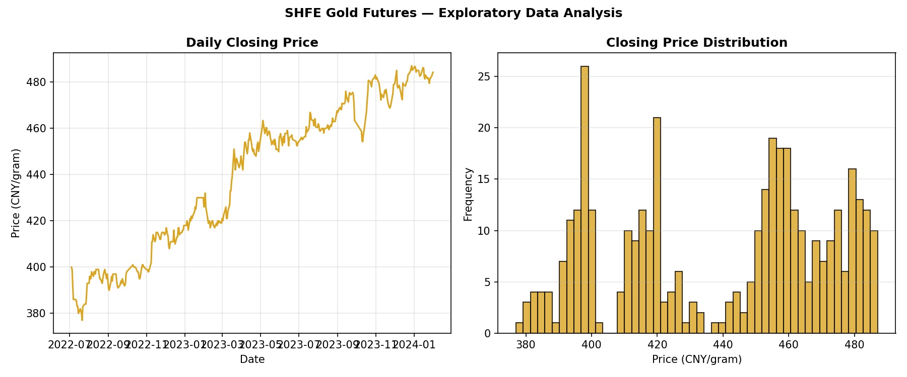
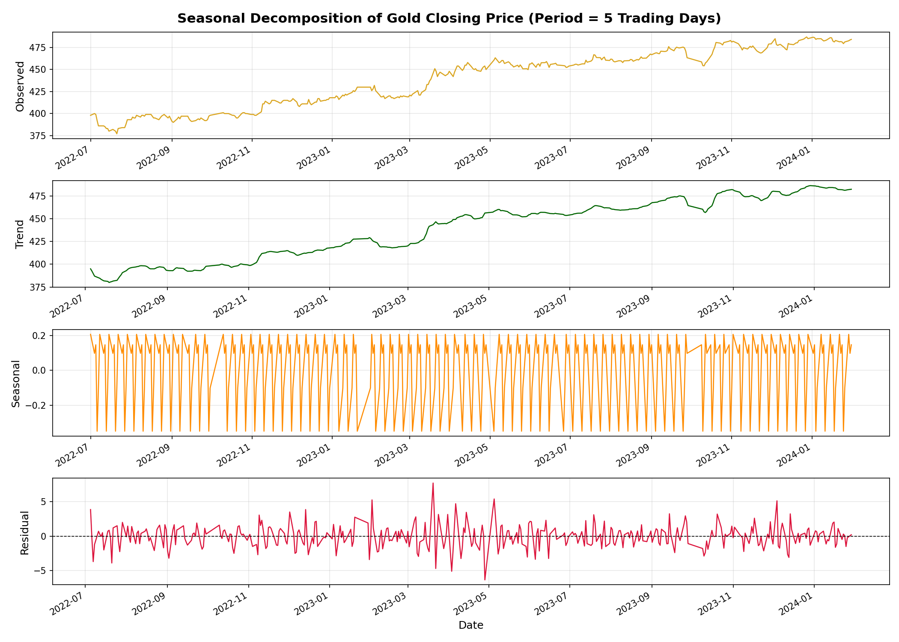
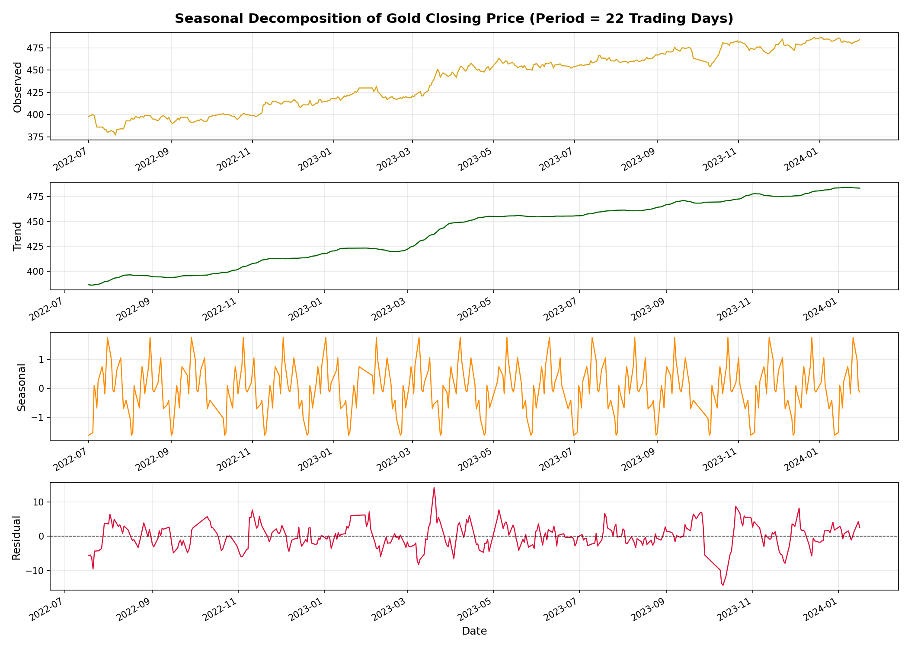
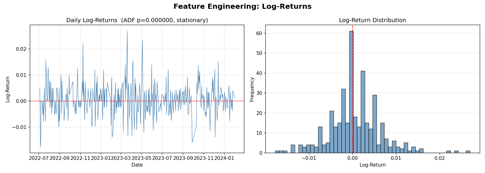
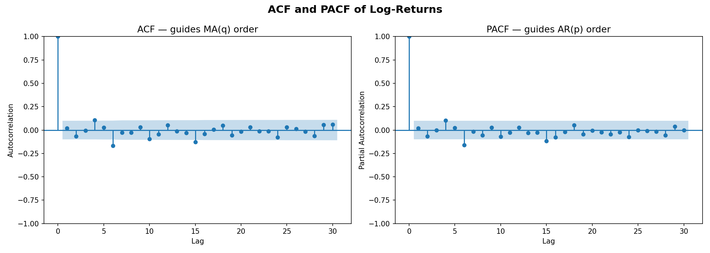
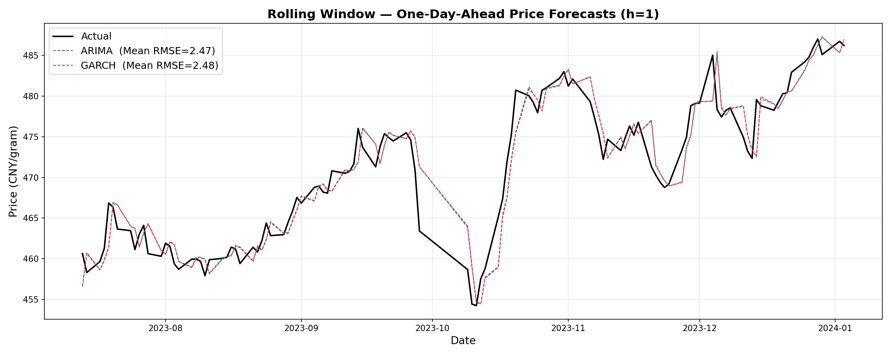
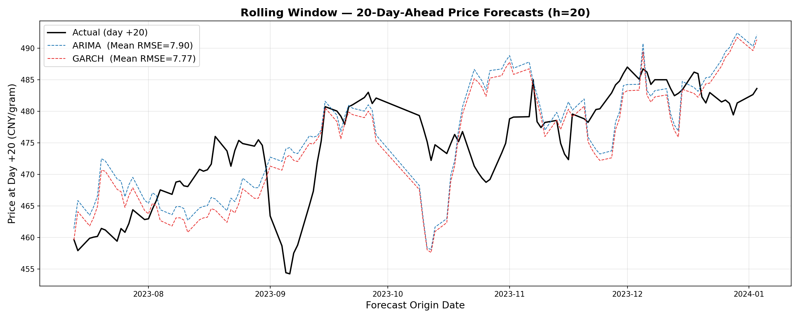
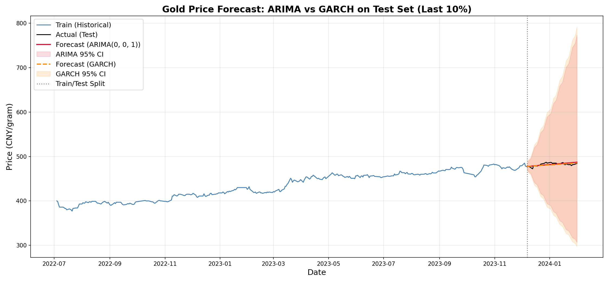

# Forecasting Gold Futures Prices with ARIMA and GARCH

Gold is one of the most closely watched commodities in financial markets. In this post, we walk through a complete time series forecasting project using daily closing prices from the Shanghai Futures Exchange (SHFE) gold futures contract. The dataset covers roughly 18 months of trading days, from July 2022 through January 2024, with prices quoted in CNY per gram.

The goal is straightforward: can we build statistical models that produce useful price forecasts? We explore two classic approaches, ARIMA and GARCH, evaluate them with a rigorous rolling-window methodology, and connect the results to the real-world events that actually moved gold prices during this period.

---

## The Dataset at a Glance

The dataset contains daily observations of SHFE gold futures (ticker AU_SHF). For this analysis, we focus on the closing price. There are no missing values, so the data is clean from the start.

**Exhibit 1: Daily Closing Price and Distribution**

*Exhibit 1 shows the daily closing price trend (left) and the histogram of closing prices (right). Gold prices rose steadily from around 380 CNY/gram to nearly 490 CNY/gram over the observation period.*

There is a clear upward trend across the entire period. The histogram reveals a multimodal distribution with clusters around 395, 420, and 455 to 480 CNY/gram, corresponding to distinct price phases the market passed through.

---

## Time Series Analysis

Before fitting any forecasting model, we check stationarity and seasonality. An ADF test on the raw closing price confirms that the series is non-stationary. We decompose the closing price at two frequencies: a 5-day (weekly) cycle and a 22-day (monthly) cycle.

**Exhibit 2: Weekly Seasonal Decomposition**

*Exhibit 2 decomposes the closing price into observed, trend, seasonal, and residual components at a 5-day (weekly) cycle.*

The decomposition splits the raw price into four parts. The observed panel is simply the original closing price. The trend component captures the long-term direction of the series after short-term noise is smoothed out; here it shows a persistent upward movement from roughly 385 to 480 CNY/gram, with a noticeably steeper climb between January and May 2023. The seasonal component isolates any repeating pattern within each 5-day trading week. In this case, the swings are only about plus or minus 0.2 CNY, which is trivial against a price level of 400 or more. The residual captures whatever is left after trend and seasonality are removed: random fluctuations, unexpected shocks, and any structure the model did not pick up.

**Exhibit 3: Monthly Seasonal Decomposition**

*Exhibit 3 repeats the decomposition at a 22-day (monthly) cycle.*

With a longer period, the trend line becomes smoother because it averages over more days. The monthly seasonal swings grow to roughly plus or minus 1.5 CNY, about five to seven times larger than the weekly pattern, hinting at a mild within-month rhythm. However, this is still less than 0.4% of the price level, far too weak to be actionable. The residuals in both decompositions stay centered around zero with no obvious drift, which is a good sign that the trend component is doing its job.

The key takeaway is that while both decompositions confirm a strong and steady upward trend, neither reveals meaningful seasonality. This rules out seasonal models like SARIMA and lets us focus on simpler specifications.

---

## Feature Engineering: Why Log-Returns Instead of First Differences?

Since raw prices are non-stationary, we need a transformation before modeling. The two most common choices are first differences and log-returns.

First differencing simply subtracts yesterday's price from today's price. It removes the trend effectively and is easy to compute. However, it has a practical drawback: the magnitude of a first difference depends on the price level. A 5 CNY move means something very different when the price is 380 versus 480.

Log-returns solve this problem. A log-return is the natural log of today's price divided by yesterday's price. This gives us a quantity that is roughly equivalent to a daily percentage change, making it comparable across different price levels. Log-returns also have a nice statistical property: they are additive over time. If you want the cumulative return over five days, you simply add up the five daily log-returns, which is much cleaner than compounding raw percentage changes.

For financial data specifically, log-returns tend to behave more symmetrically and are closer to normally distributed than first differences. This makes them a better fit for the distributional assumptions underlying ARIMA and GARCH.

**Exhibit 4: Daily Log-Returns**

*Exhibit 4 shows the log-return series (left) and its distribution (right). The ADF p-value is near zero, confirming stationarity. Note the fat tails: extreme moves happen more often than a normal distribution would predict.*

**Exhibit 5: ACF and PACF of Log-Returns**

*Exhibit 5 shows the ACF (left) and PACF (right). Nearly all lags fall within the confidence bands, suggesting very low autocorrelation and that low-order models will suffice.*

An AIC grid search confirms ARIMA(0, 0, 1) as the best specification.

---

## Understanding the Models

### ARIMA(0, 0, 1): What Does Each Number Mean?

The three numbers in ARIMA(p, d, q) stand for: p = the number of autoregressive (AR) terms, which use past values to predict the present; d = the degree of differencing applied to make the series stationary; and q = the number of moving average (MA) terms, which use past forecast errors to adjust predictions.

Our model is ARIMA(0, 0, 1) (or also MA(1)). The p = 0 means we are not using any past return values directly. The d = 0 means we are not differencing inside the model, because log-returns are already stationary. The q = 1 means we use one moving average term: the model looks at how far off yesterday's prediction was and applies a correction. In plain terms, it says "start with a constant expected return, and if I was too high yesterday, nudge today's forecast down a bit, and vice versa."

This simplicity is actually a finding in itself. It tells us that gold log-returns have very little predictable structure from a linear perspective, which is consistent with the idea that gold markets are fairly efficient at the daily level.

### GARCH(1, 1) with Student-t Errors: Modeling Uncertainty

While ARIMA focuses on predicting the average return, GARCH focuses on predicting how volatile the market is at any given moment. GARCH stands for Generalized Autoregressive Conditional Heteroskedasticity, but the intuition is simple: it models the size of price swings over time.

The (1, 1) in GARCH(1, 1) means two things. The first 1 says we use yesterday's squared return (the actual size of the surprise) to update our volatility estimate. The second 1 says we carry forward yesterday's volatility estimate. Together, this creates a self-updating system: if the market had a big move yesterday, GARCH raises its volatility forecast today, and that elevated forecast decays slowly back to normal over time. This captures the well-known phenomenon of volatility clustering in financial markets.

The Student-t errors are the final important piece. A standard model assumes that returns follow a normal distribution, where extreme events are very rare. But as Exhibit 4 shows, gold returns have fat tails: large daily moves happen more frequently than a normal distribution predicts. The Student-t distribution has heavier tails, which means it assigns a higher probability to these extreme events. Using it produces more realistic confidence intervals, meaning the model does not falsely understate risk.

---

## Results

Rather than relying on a simple train/test split, we use an expanding-window approach. Starting with 250 trading days (roughly one year), the model trains on all data up to a given day and predicts future prices. The window slides forward by one day, and we repeat, producing hundreds of genuinely out-of-sample predictions at two horizons: h = 1 (next-day) and h = 20 (roughly one trading month).

**Exhibit 6: One-Day-Ahead Forecasts (h = 1)**

*Exhibit 6 shows actual versus predicted closing prices for the one-day-ahead rolling forecast. ARIMA mean RMSE = 2.47, GARCH mean RMSE = 2.48 CNY/gram.*

We evaluate both models using two metrics. RMSE (Root Mean Squared Error) measures forecast accuracy in the same unit as the price (CNY/gram) and penalizes large misses more heavily because it squares each error before averaging. MAE (Mean Absolute Error) also reports in CNY/gram but treats all errors equally by taking the simple average of absolute differences. Using both together gives a fuller picture: if RMSE is much larger than MAE, it signals that a few big misses are dragging the average up, which is exactly the kind of thing a risk manager would want to know.

At the one-day horizon, both models track the actual price almost perfectly. ARIMA holds a very slight edge (RMSE 2.47 versus 2.48 for GARCH). This is expected: a one-day-ahead forecast is dominated by yesterday's known price, and the predicted log-return only adds a tiny adjustment. In practical terms, an RMSE of roughly 2.5 CNY/gram on a price around 470 means the average daily forecast error is about 0.5%, which is quite strong for a univariate model with no external inputs.

**Exhibit 7: 20-Day-Ahead Forecasts (h = 20)**

*Exhibit 7 shows the same comparison at a 20-day horizon. GARCH RMSE = 7.77, ARIMA RMSE = 7.90 CNY/gram.*

At the 20-day horizon, the picture shifts. RMSE roughly triples compared to h = 1, which is natural because uncertainty compounds over a longer window and each day's small forecast error accumulates. The two model lines also diverge more visibly. GARCH edges ahead here (7.77 versus 7.90), which makes intuitive sense: its ability to adjust its volatility estimate day by day means it produces a more realistic forecast path over multiple steps. ARIMA, by contrast, assumes constant variance and has no mechanism to widen or narrow its predictions when the market becomes more or less turbulent.

It is also worth noting that the gap between RMSE and MAE grows at h = 20, suggesting that the larger errors are becoming more influential. This is consistent with what we see in the chart: both models occasionally overshoot or undershoot by a noticeable margin around sudden moves (such as the October 2023 drop), and those outlier misses inflate RMSE more than MAE.

**Exhibit 8: ARIMA vs GARCH on the Test Set**

*Exhibit 8 shows the full historical series with a 90/10 train-test split, including 95% confidence intervals for both models.*

This final chart puts confidence intervals front and center. The ARIMA band fans out rapidly because the model assumes the same level of uncertainty every day, so its confidence interval simply widens at a constant rate as the horizon extends. The GARCH band is noticeably tighter because it updates its variance forecast dynamically: when recent returns have been calm, GARCH narrows the band, and when volatility spikes, it widens. For anyone making decisions based on these forecasts, the GARCH intervals are more trustworthy because they reflect what the market is actually doing right now rather than relying on a fixed historical average of risk.

---

## What Drove These Gold Prices?

Three real-world factors align closely with the turning points in our data. First, shifting Federal Reserve rate expectations were the dominant driver: gold climbed steadily as the market moved from expecting continued hikes to pricing in rate cuts by late 2023, and international gold hit a record high in December. Second, the PBoC resumed gold purchases in November 2022 (its first increase since 2019), buying continuously for 18 months and creating structural support under prices. Third, the Israel-Hamas conflict beginning October 7, 2023 triggered a sharp safe-haven rally visible in Exhibits 6 and 7, where both models lagged behind the sudden reversal. Our models capture the general trend well but cannot anticipate exogenous shocks or forward-looking policy shifts.

---

## Who Benefits and What Comes Next?

Short-term forecasts with RMSE around 2.5 are useful for commodity traders who need a statistical baseline to complement their market view. Risk managers can use GARCH's variance forecast directly in value-at-risk and margin calculations, since it adapts to current market conditions rather than assuming constant volatility. Portfolio managers rebalancing gold exposure benefit from medium-term directional signals, even when the 20-day RMSE is higher. Central bank watchers and policy analysts can compare forecast trajectories to actual prices to detect when unusual external forces are moving the market.

A natural next step would be to combine these models. An ARIMA-GARCH hybrid, where ARIMA models the conditional mean and GARCH models the conditional variance of the same series, could capture both the return signal and the volatility dynamics in a single framework. Going further, incorporating exogenous variables such as Fed fund futures, the USD/CNY exchange rate, or a geopolitical risk index into an ARIMAX-GARCH structure would let the model respond to the very factors that drove the biggest price moves in our dataset.

---

## Conclusions and Lessons Learned

This project reinforced several important lessons about time series forecasting in financial markets.

First, simplicity often wins. The best ARIMA specification turned out to be (0, 0, 1), a single moving average term. Adding more complexity did not improve performance.

Second, GARCH earns its place when you care about risk, not just the point forecast. Its tighter confidence intervals and sensitivity to volatility clustering make it a natural complement to ARIMA, especially at longer horizons.

Third, evaluation methodology matters. An expanding-window rolling forecast is far more realistic than a simple train/test split and yields much more reliable performance estimates.

Fourth, connecting model outputs to real-world context reveals both the strengths and limits of statistical forecasting. Our models captured the general trend driven by monetary policy shifts and central bank buying, but they could not anticipate geopolitical shocks or front-run the market's pricing of future rate cuts. Incorporating external features such as interest rate expectations, central bank reserve data, or geopolitical risk indices is a natural direction for future work.

Finally, fat tails are real and should not be ignored. Using Student-t errors in the GARCH model better reflects how financial returns actually behave and leads to more honest confidence intervals.

Gold price forecasting remains a challenging problem, but even simple, well-executed models can add value when paired with sound evaluation practices and an awareness of the broader forces moving the market.

